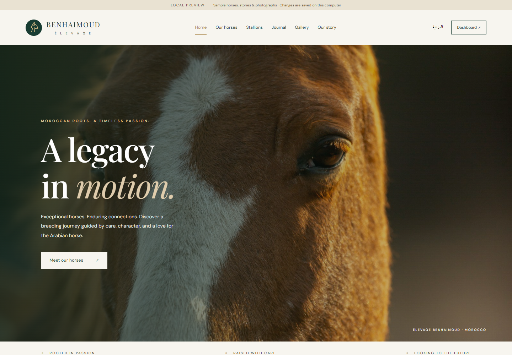

# Elevage Benhaimoud ? Website & Admin Dashboard

A horse breeding website with a public catalogue, pedigrees, journal, photo/video gallery, and an administrator dashboard. The responsive frontend is served by the same server as the API; no separate frontend build is needed.



## See it running in one command

Requires Node.js 22 or later. In this repository folder:

```sh
npm run demo
```

Open **http://localhost:5000**. The local demo uses only Node's built-in modules, so it does not require npm install, MongoDB, Cloudinary, or any credentials.

- Dashboard: **http://localhost:5000/#/admin**
- First-run email: **admin@demo.local**
- First-run password: **Benhaimoud2026!**
- Change the password from the dashboard if desired.
- Stop with Ctrl+C; run the same command to restart.
- Data and password changes persist in **.local/demo.json**, which is excluded from Git.
- Optional first-run overrides: DEMO_EMAIL and DEMO_PASSWORD. Set PORT to use another port.

The demo binds to 127.0.0.1 and is **for local preview only**. It includes fictional/sample horses, pedigrees, articles, and stock photographs. It supports photo uploads up to 5 MB. Cloudinary video uploads are available in cloud mode. Demo data is separate from MongoDB and is not automatically migrated.

To reset the demo, stop its server, back up .local/demo.json, then remove that single file. Restart to restore the sample records and first-run credentials. Do not remove it if you want to keep your changes.

## What you can use

- Homepage with featured horses, farm introduction, and recent articles.
- Horse and stallion catalogues with search, filters, and pagination.
- Horse detail pages with photographs, pedigree, and achievements when present.
- Journal with article pages; drafts stay private until published.
- Photo gallery with lightbox and cloud-mode video playback.
- English/Arabic public navigation, content fields, and right-to-left layout. Missing Arabic content falls back to the primary text. Admin controls and some metadata labels are currently English.
- Admin login, horse/pedigree editing, article draft/publish workflow, and gallery management.
- Admin password changes; changing a password invalidates existing sessions/tokens.
- Responsive mobile navigation, keyboard focus states, form errors, and loading/empty states.

## Run with MongoDB and Cloudinary

```sh
npm ci
```

Copy .env.example to .env and replace the placeholders. On PowerShell:

```powershell
Copy-Item .env.example .env
```

Configure MONGODB_URI, a random JWT_SECRET of at least 32 characters, CLOUDINARY_CLOUD_NAME, CLOUDINARY_API_KEY, CLOUDINARY_API_SECRET, ADMIN_EMAIL, and ADMIN_PASSWORD. Never commit real credentials.

```sh
node utils/seedAdmin.js
npm start
```

Open http://localhost:5000. The server waits for the database connection before listening. The production database starts empty; add your real horses and articles in the dashboard. Stop the demo first if it is using port 5000.

Use FRONTEND_ORIGINS (comma-separated origins) only if serving the frontend from a different origin. Default: http://localhost:5000. Serve the deployed app over HTTPS.

## Checks

```sh
npm test
npm run test:browser
```

API tests use a temporary local database and check authentication, validation, CRUD, draft visibility, publication, persistence, and password rotation. Browser tests use a separate temporary database and check public pages, search, admin editing, uploads, gallery viewing, mobile navigation, and Arabic layout.

Windows browser tests use installed Microsoft Edge. Elsewhere, first run npx playwright install chromium. BROWSER_PATH can override the browser executable. Screenshots go to test-results/ and are not committed. GitHub Actions runs both suites on pushes and pull requests.

MongoDB and Cloudinary integration still require verification against your configured services; local demo tests do not prove those external services work.

## Structure

| Path | Purpose |
| --- | --- |
| public/ | Website, dashboard, styles, and preview photographs |
| demo/ | Dependency-free local preview server and sample data |
| server.js | Express app serving the frontend and cloud-backed API |
| models/, routes/, controllers/ | MongoDB schemas and API behaviour |
| middleware/, utils/, config/ | Authentication, validation, uploads, setup |
| tests/ | API and browser checks |
| .github/workflows/test.yml | Continuous integration |
| Dockerfile | Cloud-mode deployment image |

## API overview

| Route | Access | Purpose |
| --- | --- | --- |
| GET /api/health | Public | Server status and mode |
| POST /api/auth/login | Public, rate limited | Admin sign in |
| GET /api/auth/me | Admin | Current administrator |
| PUT /api/auth/password | Admin | Change password |
| POST /api/auth/logout | Admin | Sign out |
| GET /api/horses | Public | Search/filter/paginate horses |
| GET /api/horses/:slug | Public | Full horse profile |
| GET /api/horses/admin/:id | Admin | Horse editor data |
| POST, PUT, DELETE /api/horses[/:id] | Admin | Manage horses |
| POST /api/horses/:id/images | Admin, cloud mode | Extra horse photos |
| GET /api/news | Public | Published articles |
| GET /api/news/:slug | Public | Published article |
| GET /api/news/admin/all | Admin | Paginated articles including drafts |
| GET /api/news/admin/:id | Admin | Full article including draft text |
| POST, PUT, DELETE /api/news[/:id] | Admin | Manage articles |
| GET /api/gallery | Public | Gallery listing |
| GET /api/gallery/admin/:id | Admin | Gallery editor data |
| POST, PUT, DELETE /api/gallery[/:id] | Admin | Manage gallery |

Cloud uploads use multipart form fields coverImage (horse/news), images (extra horse photos), or media (gallery). Demo writes use JSON with image URLs or base64 photos. Admin authentication uses an Authorization: Bearer token header. Browser tokens are kept in sessionStorage, not permanent localStorage. Cloud logout clears the browser token; token revocation occurs on password change or expiry.

## Improvements to the original backend

- Full draft retrieval for editing and publication timestamps when publishing updates.
- Stable slugs when names/titles change, preserving existing links.
- Explicit allowed update fields and safe literal search filters.
- Validated pagination and sort values; login attempt limits.
- Upload type/size limits, replaced-cover cleanup, failed-upload cleanup, and missing-horse checks.
- Password change flow and removal of password logging during admin setup.
- Clear configuration errors and database connection before startup.
- Updated upload dependencies and patched transitive dependencies; `npm audit` reported zero vulnerabilities at verification time. The `qs` override keeps Express's parser on the patched release.

## Before a real launch

1. Replace sample imagery and homepage/about copy with your real farm history, photographs, and contact details. See public/assets/CREDITS.md for stock-image sources.
2. Configure MongoDB and Cloudinary and test real login, edits, uploads, deletion, and video playback.
3. Deploy the Docker image or Node app with environment variables; connect your domain and HTTPS. The repository branch is source code, not a hosted website.
4. Enable database backups and error monitoring. Test restoring a backup. Cloud media cleanup failures are logged; orphan cleanup and distributed rate limiting are future operational improvements.
5. Review Arabic translations, add a password-recovery process if needed, and decide whether you need contact forms, booking, sales, or other business features.

Local demo storage is intended for a single running process. Do not expose it publicly or use it as a production database.

